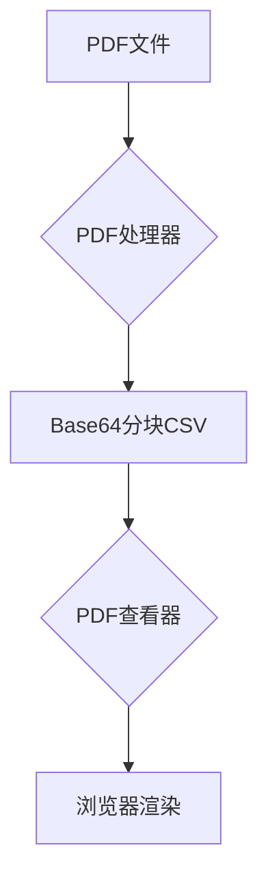

# PDF Viewer for Guanyuan BI


## 功能架构



## 组件说明

### 1. PDF处理器 (`pdf_to_csv.py`)
```python
├── 输入处理
│   ├── PDF文件验证
│   ├── 二进制读取
│   └── Base64编码
├── 数据处理
│   ├── 分块切割
│   ├── DataFrame构建
│   └── 序号生成
└── 输出处理
    ├── 目录自动创建
    └── CSV文件生成
```

### 2. PDF查看器 (`index.html`)
```javascript
├── 数据加载
│   ├── Base64验证
│   ├── 数据清洗
│   └── 二进制转换
├── 渲染引擎
│   ├── 分页渐进加载
│   ├── 动态缩放
│   └── Retina适配
└── UI组件
    ├── 加载指示器
    ├── 错误提示
    └── 阴影效果
```

## 快速开始

### 后端处理
```bash
# 安装核心依赖
pip install pandas==2.0.0

# 处理示例文件
python pdf_to_csv.py \
  --input_path "./documents/sample.pdf" \
  --output_dir "./output" \
  --chunk_size 2048
```

### 前端集成
```html
<!-- 最小化集成示例 -->
<!DOCTYPE html>
<html>
<head>
    <meta charset="UTF-8">
    <title>PDF Viewer</title>
    <!-- 必需依赖 -->
    <script src="https://cdn.jsdelivr.net/npm/pdfjs-dist@2.7.570/build/pdf.min.js"></script>
    <script src="https://cdn.jsdelivr.net/npm/pdfjs-dist@2.7.570/build/pdf.worker.min.js"></script>
</head>
<body>
    <div id="pdf-container"></div>
    
    <script>
    // 数据加载示例
    async function loadPDF() {
        const response = await fetch('output/sample.csv');
        const data = await response.json();
        
        renderChart(data, null, {
            // 可选配置
            renderBatchSize: 5,    // 设置批量渲染页数
            maxScale: 2.0         // 最大缩放比例
        });
    }
    </script>
</body>
</html>
```

## 高级配置

### 处理器参数
| 参数 | 类型 | 验证规则 | 默认值 | 作用域 |
|------|------|----------|--------|--------|
| input_path | str | *.pdf 文件存在 | - | 必需 |
| output_dir | str | 有效路径 | - | 必需 |
| chunk_size | int | 512-4096 | 1024 | 可选 |
| output_filename | str | 合法文件名 | 源文件名 | 可选 |

### 查看器配置
```javascript
// 通过config对象传递
{
    renderBatchSize: 3,       // 同时渲染页数
    maxScale: 1.5,            // 最大缩放比例
    minScale: 0.8,            // 最小缩放比例
    pageSpacing: 20,          // 页间距(px)
    enableShadow: true        // 启用页面阴影
}
```

## 性能指标

| 项目 | 规格 |
|------|------|
| 最大文件尺寸 | ≤50MB |
| 分块处理速度 | 10MB/s |
| 页面渲染时间 | ≤500ms/页 |
| 内存占用 | ≤50MB + 文件大小 |

## 故障排除

```bash
# 常见错误处理流程
graph TD
    E[错误发生] --> F{错误类型?}
    F -->|文件错误| G[检查路径权限]
    F -->|编码错误| H[验证Base64完整性]
    F -->|渲染错误| I[更新PDF.js版本]
    G --> J[重试操作]
    H --> K[重新生成CSV]
    I --> L[清理浏览器缓存]
```

## 版本兼容性

| 组件 | 版本 | 要求 |
|------|------|------|
| Python | ≥3.8 | 必需 |
| pandas | ≥2.0 | 必需 |
| PDF.js | 2.7.570 | 严格匹配 |
| 浏览器 | Chrome 90+ | 推荐 |

## 许可协议
本项目采用 [MIT License](https://opensource.org/licenses/MIT)，允许基于本项目的商业和非商业用途。使用PDF.js组件需遵守其[BSD-3协议](https://github.com/mozilla/pdf.js/blob/master/LICENSE)。
